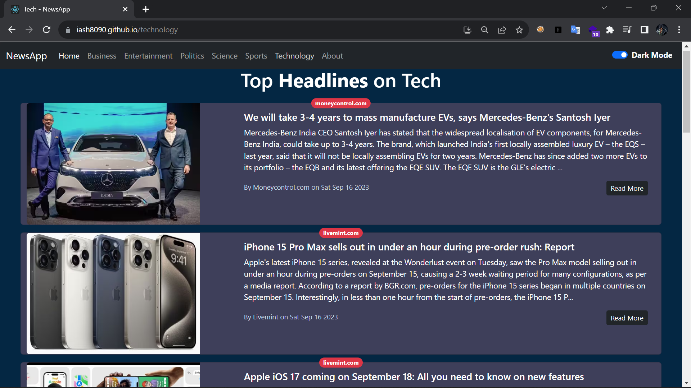

# News App

This project is based on React Js. Here user can Look for Daily News of India based on their interest like Sports, Entertainment, Politics, Science etc.

This Project is Deployed on Github pages
<a href="https://iash8090.github.io/newsapp-React/" target="_blank">https://iash8090.github.io/newsapp-React/</a>

For this project I am using NewsCatcherapi <a href="https://newscatcherapi.com/" target="_blank">https://newscatcherapi.com/ </a> website to fetch the daily news API.

If, in future, there are no News showing on website, that means my Free API limit has been exhausted.

### Steps to install this project

First install dependencies.

> npm install

Start Project

> npm start

### Website Preview

